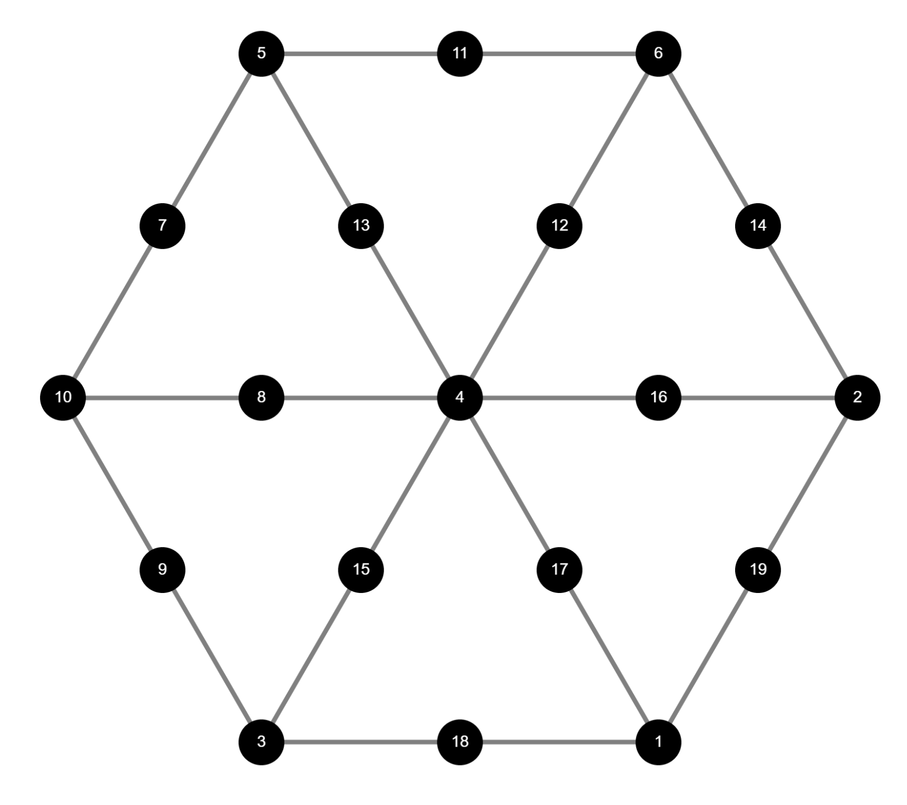

# Magic 19

A while ago, I got intrigued by one of the mathematical puzzles proposed by the Plus Magazine &mdash; an online magazine about math &mdash; it was called <a href="https://plus.maths.org/content/magic-19">Magic 19</a>. The puzzle consisted in allocating numbers from 1 to 19 to each of the 19 vertices of this graph with hexagonal shape

such that each triad of vertices aligned along the edges of the hexagon must sum up to 22.

To be honest, I was not intrigued by the puzzled itself, but by a reader's comment which said that this problem made an excellent case to be solved by linear programming. Now, I'm not much into solving this kind of numerical puzzles, such as Sudoku, in which one has to allocate numbers provided some constraints &mdash; I usually get bored soon. However, I'm totally into defining problems as convex optimization problems! I find this process very rewarding, particularly when at first sight the problem at hand doesn't look like an optimization problem. So, I went for it and managed to transform Magic 19 into an Integer Linear Program (ILP) which I implemented in R using <a href="www.gurobi.com">Gurobi</> or <a href="http://lpsolve.sourceforge.net/5.5/">LPSolve</a> as linear programming solvers. Further, I generalized the problem, allowing the user to define other polygonal shapes: squares, pentagons, hexagons, heptagons... as well as a different number for the sum of the vertex triads.

This was back in 2017, when I did not know how to make web applications, in fact, I did not know how websites functioned at all. Now that I have learnt some stuff, I thought that it would be cool to port my solution to JavaScript, using <a href="http://hgourvest.github.io/glpk.js/">GLPK.js</a> as ILP solver, <a href="https://js.cytoscape.org/">Cytoscape.js</a> to represent the graph and some HTML5 and CSS3 to make a small web application. So, this is my attempt, I hope it will bring some fun to the world! &mdash; that is, for these that do enjoy solving these kind of puzzles, anyway &#128579;.

***

# R files:
Solving the Magic N-gon
This repository contains the R code of two functions designed to solve and explore the "magic n-gon"
The Magic N-gon is a mathematical puzzle inspired by the challenge proposed by the Plus Magazine:
https://plus.maths.org/content/magic-19
It contains two programs, the first one, MagicPolygon, tries to find a solution to the problem
(details in the link provided). It allows to change the problem from an hexagon to any other polygon,
as well as change the value of the sum of 3 adjacent nodes in the associated graph. Of course, feasible
solutions are not guaranteed. The programs solves an Integer Linear Program. Requires either the R package lpSolve,
a standalone free solver, or a working instalation of Gurobi (licensed) as well as the wrapper for R installed.
The second program, MagicPolygonAO, samples alternative solutions to the puzzle. Not all solutions are guaranteed
to be unique (although this could be fixed)
